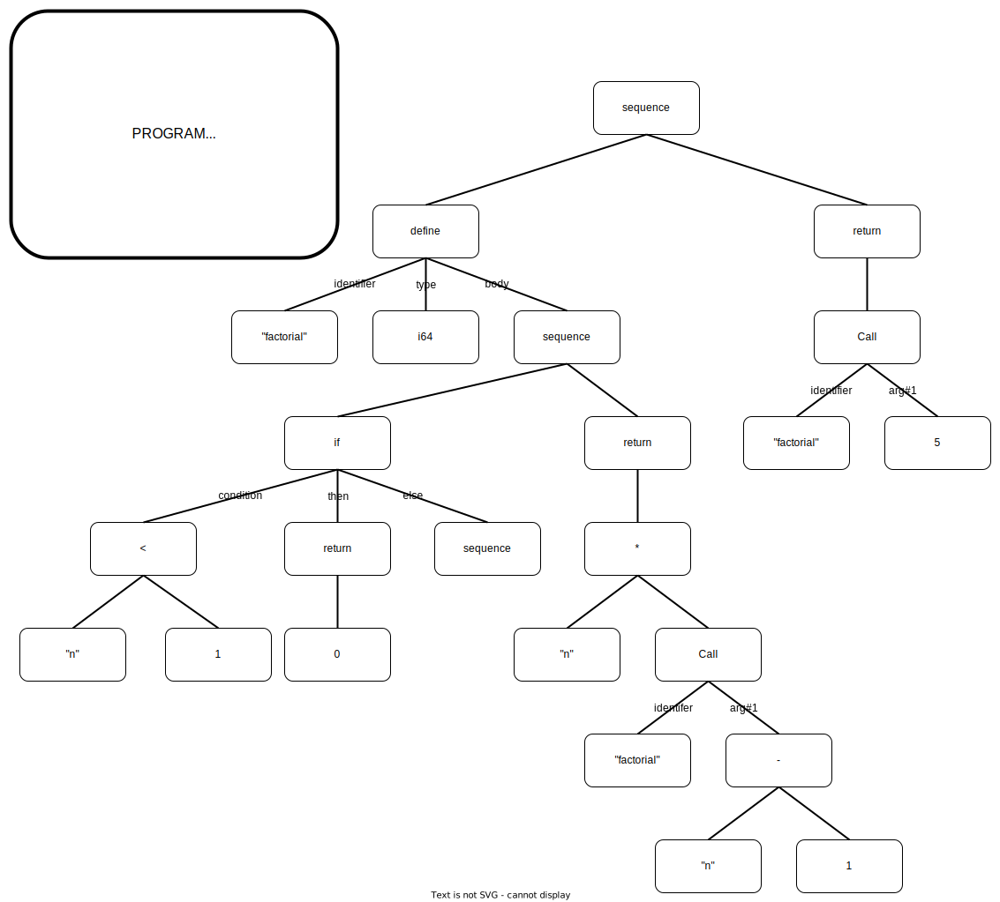

## Description

The Funk's AST is composed of several logic nodes. Those nodes provide the boilerplate functions for the language to execute logic:

- `sequence`: a list of following instructions
- `define`: initialize a variable with a given type
- `assign`: change a defined variable's value
- `return`: instruction for a scope to return a given expression
- `if`: conditional statement, can optionnaly have an else block
- `while`: iterative statement, looping over a scope given a condition
- `break`: instruction for a loop to get out
- `continue`: instruction for a loop to go to the next iteration

But it is also composes of node expressing values. As a function call, arithmetic or boolean operations and even array indexing:

- `call`: a call to a defined function
- `indexing`: dereference a pointer to an array with a given offset
- `int`: a valid integer number
- `float`: a valid floating number
- `array`: an array of a given size and type
- `binop`: a binary operator, logic or arithmetic
- `unop`: a unary operator
- `identifier`: the name of a variable

Using theses nodes the Funk's AST is able to sequence the logic of a funk program giving it iterative logic with the use of `while` loops, conditional logic using `if` and functional logic using `call` and `lambda`.

### Representation

Here is the representation of the generated AST for a recursive factorial function:

